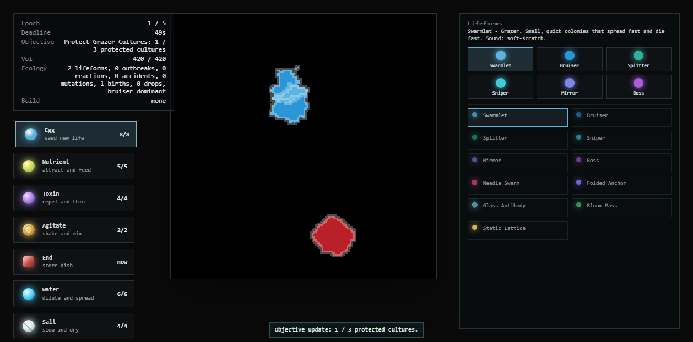

# Lifeform Math Cheat Sheet

Captured from `http://localhost:5175/?v=centroid-cheat-sheet-20260606` on 2026-06-06.

## Top-left pooling diagnosis

The repeated top-left coalescing pattern was a math bug, not intentional emergent behavior. It had **two** root causes, fixed separately:

**Cause 1 (fixed 2026-06-06):** the live dish is non-wrapping, but cell centers were still calculated with toroidal circular-mean math. That is correct for a wraparound world, where pixels at `x = 0` and `x = LX - 1` are neighbors. In the Petri dish, those pixels are opposite edges, so the center must be the linear centroid. When fragmented organisms touched opposite sides, their reported center could jump to the coordinate seam.

**Cause 2 (fixed 2026-06-10):** `recomputeCenter` reset a dead cell's center to `[0, 0]` — the top-left corner — and two systems consumed that corpse coordinate. The splitter on-death handler read the already-zeroed center, so every dead splitter spawned its offspring at the corner. And `chooseEcosystemTarget` never checked that the control sample was alive, so once it died its corpse sat at `[0, 0]` and anything within threat range locked onto it forever. Fixes: dead cells retain their last known center, and targeting ignores a dead control sample. (The same pass widened the grid to `Uint16Array`; a `Uint8Array` wrapped cell id 256 to empty and 257 to the control sample.)

Fixed rule:

| Dish mode | Center math | Expected result |
| --- | --- | --- |
| `wrap: true` | Circular mean per axis: `angle(sum(exp(2*pi*i*x/L))) * L / (2*pi)` | Cells crossing an edge still report one continuous center. |
| `wrap: false` | Linear centroid: `sum(x) / vol`, `sum(y) / vol` | Opposite-edge fragments report a midpoint inside the dish, not the seam. |

## Global movement math

| System | Maths | Behavior | What we expect |
| --- | --- | --- | --- |
| Target vector | `v = target.center - self.center` when `wrap:false`; shortest torus vector when `wrap:true` | Every lifeform controller starts from the same displacement rule. | No directional bias in non-wrapped dishes. |
| Target choice | Prefer closest living non-player culture, then multiply score by `0.22` for preferred archetypes and `2.5` for avoided archetypes. If the control sample is within `PLAYER_THREAT_RANGE`, target it. | Species feel like they have appetites without becoming scripted teams. | Nearby threats matter, but ecology preferences create readable clustering. |
| Intent | `intent.vec = normalize(v)`, `intent.speed = spawn.speed` unless the controller overrides it | Controllers do not move pixels directly; they set a desired direction. | Blobs drift, stretch, and chew through cellular automata rather than sliding like sprites. |
| Monte Carlo movement | `dH_mov = -(dir dot (intent.vec * intent.speed))` | Pixel copies aligned with intent are more likely to be accepted. | Movement remains stochastic and organic. |
| Engulf | If distance `<= 6`, `dH_engulf = -(engulfMultiplier - 1)` | Close predators absorb other cells much more readily. | Touching cells can flare into violent feeding without guaranteed deletion. |
| Volume pressure | Source cost `2 * (vol - targetVol) + 1`; target cost `-2 * (vol - targetVol) + 1` | Overgrown cells resist more growth; undersized cells resist shrinkage. | Cultures breathe around target mass instead of expanding forever. |

## Base lifeforms

| Name | Maths | Behavior | What we expect |
| --- | --- | --- | --- |
| Swarmlet | `targetVol = 120`, `speed = 12`, `engulfMultiplier = 4`, instability `1.6`; targets via ecology preferences. | Small grazing colonies spread quickly and collapse quickly. They prefer Splitters and avoid Bruisers/Bosses. | Early dish motion, flocking, edible biomass, good discovery fuel. |
| Bruiser | `targetVol = 450`, `speed = 8`, `engulfMultiplier = 6.5`; moves directly toward target. | Heavy predator feeder. Prefers Swarmlets/Splitters, avoids Bosses. | Slow pressure object that can become dominant if fed or left unchecked. |
| Splitter | `targetVol = 300`, `speed = 8`, `engulfMultiplier = 6.5`; on death, arena spawns two Swarmlets at last center +/- 3px. | Bruiser-like propagator with a death burst. Prefers Swarmlets/Mirrors, avoids Bruisers. | Creates second-order surprises and keeps ecosystems from becoming too clean. |
| Sniper | `targetVol = 240`, `speed = 12`; flee if distance `< 25`, approach if `> 60`, hold between; fires every `45` ticks, bullet speed `2`, bullet size `3`, shot cost `targetVol -= 3`. | Lean suppressor that manages distance and shoots through crowds. Prefers Bruisers/Bosses, avoids Swarmlets. | A ranged pressure species, not a melee feeder. Should feel clever and slightly slippery. |
| Mirror | Defaults are replaced from the control sample at spawn; otherwise `targetVol = 300`, `speed = 10`, `engulfMultiplier = 5`. | Mimic feeder that echoes the control sample profile. Prefers Bruisers/Snipers. | Makes player build choices appear back in the dish as a hostile reflection. |
| Boss | `targetVol = 1350`, `speed = 8`, `engulfMultiplier = 6.5`; at `vol < spawn.targetVol * 0.5`, spawns three medium Bruisers once. | Anchor organism that drags heavy colonies into stable danger. Prefers Bruisers/Splitters/Mirrors, avoids Snipers. | Big strategic mass, visible ecology center, late-run drama. |

## Discovered breeds

Discovered breeds do not have separate controller files. Each breed inherits its `baseArchetype` controller, then multiplies spawn stats and adds traits.

| Name | Maths | Behavior | What we expect |
| --- | --- | --- | --- |
| Needle Swarm | Base Sniper; `targetVol x 0.74`, `speed x 1.28`, `engulf x 0.9`, instability `x 1.35`; traits Fleet + Fragile. | Fast, brittle shooter strain triggered by critical flare near suppressors. | A dangerous, thin ranged culture that should read as rare and sharp. |
| Folded Anchor | Base Boss; `targetVol x 0.86`, `speed x 0.72`, `engulf x 1.18`, instability `x 0.68`; traits Gelatinous + Toxin Resistant. | Slow anchor produced by fold faults inside anchor cultures. | Protein-folding / Wolfram-rule vibe: stable, heavy, strange. |
| Glass Antibody | Base Bruiser; `targetVol x 0.82`, `speed x 1.05`, `engulf x 1.24`, instability `x 1.05`; traits Toxin Resistant + Fragile. | Brittle resistant feeder produced by crystal or flare stress. | Sharp counter-culture that cracks lanes open without being a pure boss. |
| Bloom Mass | Base Splitter; `targetVol x 1.32`, `speed x 0.82`, `engulf x 1.08`, instability `x 0.95`; traits Budding + Gelatinous. | Soft overfed propagator from nutrient conduit reactions. | Big squishy reproduction engine. Reward curiosity more than punish it. |
| Static Lattice | Base Mirror; `targetVol x 0.94`, `speed x 0.78`, `engulf x 0.96`, instability `x 0.74`; traits Toxin Resistant + Budding. | Flickering mimic born from agitated chain patterns. | Repeating color-cycle / old computer pattern organism. |

## Hybrid breeds

Hybrids declare a `parents` pair on their `BreedDef`. Once both parents are discovered, a cell of each sitting within `16` px of the other inside a nutrient/conduit/bloom field hybridizes into the offspring. Hybrid stats multiply off the hybrid's own `baseArchetype` defaults (not the runtime parent) so they never compound off an already-bred cell.

| Name | Maths | Behavior | What we expect |
| --- | --- | --- | --- |
| Quill Bloom | Needle Swarm x Bloom Mass; base Splitter; `targetVol x 1.12`, `speed x 1.14`, instability `x 1.2`; traits Budding + Fleet + Fragile. | Swelling propagator with a fast, prickly edge. | Reward for breeding the two most discoverable parents. |
| Vitric Anchor | Glass Antibody x Folded Anchor; base Boss; `targetVol x 1.04`, `speed x 0.7`, `engulf x 1.22`, instability `x 0.7`; traits Toxin Resistant + Gelatinous + Fragile. | Brittle, toxin-proof fortress that slows local motion. | Late-game anchor for players who chase both crystal lines. |
| Mire Lattice | Static Lattice x Bloom Mass; base Mirror; `targetVol x 1.18`, `speed x 0.74`, instability `x 0.8`; traits Budding + Toxin Resistant + Gelatinous. | Self-copying pattern mass that keeps budding tiles of itself. | Pattern-organism payoff for the lattice discovery chain. |

## Mutation traits

| Trait | Maths | Behavior | What we expect |
| --- | --- | --- | --- |
| Fleet | `speed x 1.18`, `targetVol x 0.93`, toxin `x 1` | Faster, less reserve mass. | More motion, slightly more risk. |
| Gelatinous | `speed x 0.9`, `targetVol x 1.22`, toxin `x 0.92` | Bigger, slower, more disruption-resistant. | Protein-folded heaviness. |
| Toxin Resistant | `speed x 0.98`, `targetVol x 1`, toxin `x 0.52` | Survives dangerous fields. | Lets players discover counterplay. |
| Fragile | `speed x 1.1`, `targetVol x 0.82`, toxin `x 1.32` | Fast metabolism, poor structure. | Volatile strains that invite catalyst play. |
| Budding | `speed x 0.96`, `targetVol x 1.16`, toxin `x 0.95` | Larger recovery reserve and daughter-colony tendency. | Good seed for bloom and conduit recipes. |

## Tool and reaction modifiers

| Input | Maths | Behavior | What we expect |
| --- | --- | --- | --- |
| Nutrient / Bloom | Pulls cells toward effect center; increases `targetVol`; bloom uses stronger pull/growth. | Food attracts and fattens cultures. | Player learns that water plus food can build lanes. |
| Water | Pushes cells away from center; increases `targetVol` slightly; spreads reagent consequences. | Dilutes and spreads. | Curiosity-friendly tool with indirect outcomes. |
| Toxin / Acid / Flare / Lysis / Foam / Fold Fault | Pushes cells away; reduces `targetVol`; may erode pixels probabilistically by distance and toxin multiplier. | Dangerous field that scares and thins tissue. | Jeopardy without instantly trashing the dish. |
| Salt / Brine / Crystal | Caps speed and shrinks `targetVol`; crystal is strongest speed clamp. | Slows, dries, and can form brittle patterns. | Good control tool and recipe ingredient. |
| Agitate | Randomizes local movement and enables agitated chain recipes. | Adds controlled chaos. | A visible catalyst for surprise rather than a direct attack. |

## Design read

The base lifeform rules are mostly sound and symmetric. The top-left pattern was not coming from species math like "Bruisers prefer the corner"; it came from center math leaking wraparound assumptions into a non-wrapped dish. After the fix, remaining corner pooling should be treated as either real emergent behavior from walls, spawn placement, or tool use, and should be judged visually after a few long runs.
